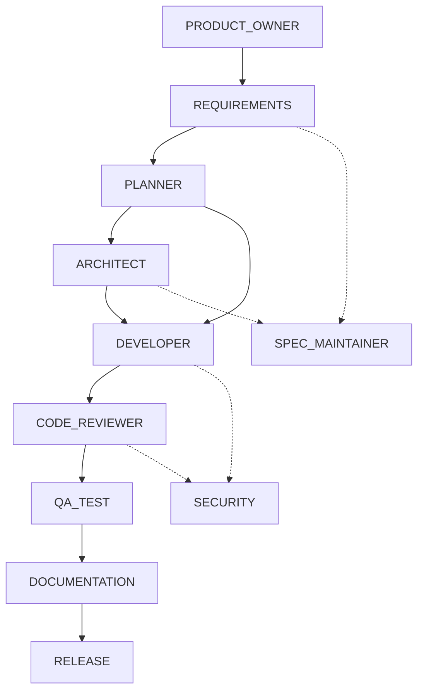
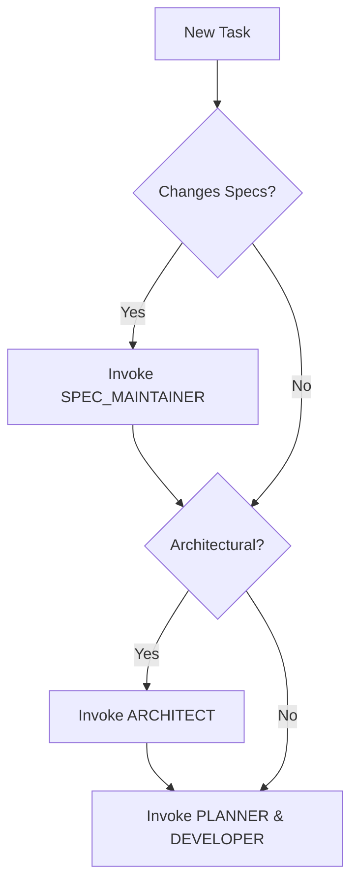

# WE Agent OS - Agent Definitions & Project Rules

## Project State
- **Active Project**: The active codebase is the TypeScript WE Agent Framework.
- **Parked Discussion**: The proposed C#/.NET agent framework discussion is formally parked.
- **Frozen Core**: The framework (`src/`) is officially frozen at version `v0.1.0-alpha`.
- **Priority Focus**: Finish the Service Report Web MVP first. The next priority is the Data Analysis Water Test.
- **Deferred Items**: History, Templates, and Settings are deferred.
- **Bridge Limitations**: The React/Vite bridge (`web-app/vite.config.ts`) is a v0.2 local-only MVP, NOT a production bridge.

## Agent Architecture
- **Business Agents**: The core product of WE Agent OS. These are the domain-specific workflows solving actual user problems (e.g., Service Report Agent, Data Analysis Agent).
- **Engineering Agents**: The internal development roles. These govern how WE Agent OS is built, tested, and released.

## Core Engineering Principles
1. **Local Agent First**: WE Agent OS strictly prefers its own local agents, skills, workflows, specs, and deterministic tools.
2. **External AI as Last Resort**: External LLMs and AI providers are advisors only and may ONLY be used as a last resort when local capabilities fail.
3. **Mandatory SPEC Maintainer**: You must always consult the SPEC Maintainer agent and update the `context/` directory when requirements or specifications change.
4. **No Framework Changes**: Absolutely no changes may be made to the `src/` framework code without a formally approved RFC.
5. **QA/Test Checkpoint**: The QA/Test Agent is strictly required to pass all acceptance criteria and run automated tests *before* any code is committed.
6. **Release Checkpoint**: The Release Agent is strictly required *before* any code is pushed to remote repositories.

## Agent Lifecycle
Engineering Agents follow a strict lifecycle from Product Ownership -> Requirements -> Architecture -> Development -> QA -> Release. No agent may bypass this lifecycle or skip mandatory gates.

## Agent Authority Matrix
- **Requirements/Planning**: Owned by Product Owner, Requirements, and Planner Agents.
- **System Design**: Owned by Architect Agent.
- **Implementation**: Owned by Developer Agent.
- **Quality & Security**: Owned by Code Reviewer, QA/Test, and Security Agents.
- **Deployment**: Owned by Release Agent.

## Mandatory Handoff Rules
Agents must explicitly hand off their artifacts to the next agent in the lifecycle. Hand-backs occur when an approval gate is failed.

## Invocation Rules
Internal Engineering Agents are invoked sequentially or hierarchically. They must consume the standardized inputs (e.g., `implementation_plan.md`) and produce standardized outputs.
## Agent Lifecycle

## Agent Invocation Decision Tree

## External AI Advisor-Only Clarification
External AI tools (like Claude, GPT, etc.) act purely as *advisors*. They do not possess runtime authority. All final decisions, file modifications, and commits must be funneled through and approved by the Local Engineering Agents according to strict local rules.
